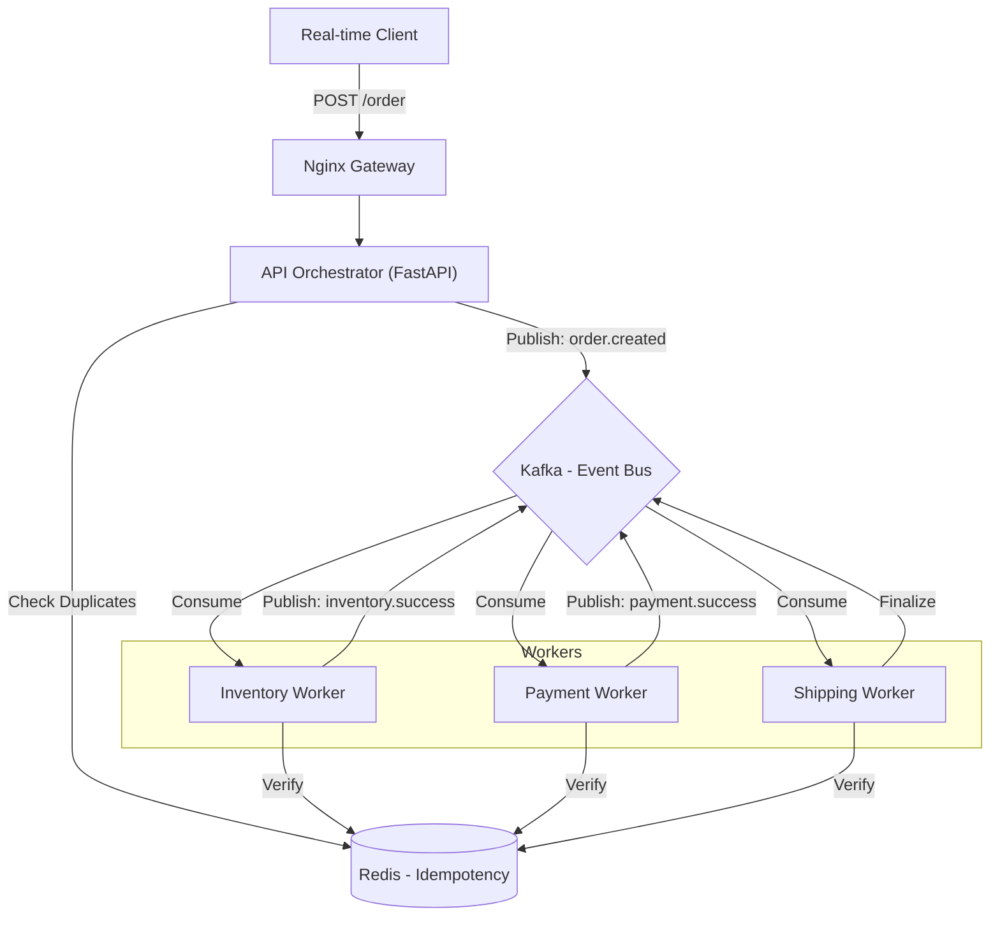

# Saga Orchestrator

A robust, event-driven Saga Orchestrator built with FastAPI, Kafka (Avro), and Redis for idempotent distributed transactions.

## High-Level Design (HLD)



## Key Features
- **Choreography-based Saga**: Decentralized transaction management using Kafka events.
- **Avro Serialization**: Efficient, schema-enforced messaging.
- **Idempotency**: Redis-backed request de-duplication across all layers.
- **Modern Infrastructure**: Containerized with health-checks and automated dependency orchestration.

## Getting Started

1. **Start the Infrastructure**:
   ```bash
   sudo docker-compose up -d --build
   ```

2. **Run Integration Tests**:
   ```bash
   python testing_file.py
   ```

## Stack
- **Backend**: FastAPI (Python 3.11)
- **Messaging**: Kafka (Confluent 7.5.0)
- **Serialization**: Avro (fastavro)
- **Storage**: Redis (Idempotency)
- **Observability**: Prometheus, Loki, Kafdrop
